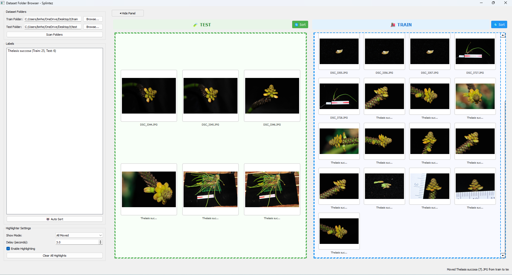

<div align="center">
  
</div>

# Dizly - Intelligent Image Dataset Manager

**Dizly** is a powerful PyQt5-based application designed for machine learning practitioners and researchers who need to organize, sort, and manage image datasets efficiently. With advanced AI-powered auto-sorting capabilities and an intuitive drag-and-drop interface, Dizly streamlines the process of preparing high-quality training and testing datasets.

## 🚀 Key Features

### 🤖 **DINOv2-Powered AI Sorting**
- **State-of-the-art Meta DINOv2**: Superior image understanding with vision transformers
- **Multi-Level Duplicate Detection**: Advanced algorithms using semantic similarity, perceptual hashing, and structural analysis
- **Intelligent AI Backend**: Automatic fallback from DINOv2 → CLIP → ResNet50 → Color histograms
- **Advanced Image Analysis**: Comprehensive quality metrics, content complexity analysis, and rotation-invariant similarity

### 📁 **Smart Dataset Organization**
- **Train/Test Split Management**: Organize images into training and testing sets with customizable ratios
- **Label-based Organization**: Automatically detect and organize images by labels/categories
- **Drag & Drop Interface**: Intuitive image management with visual feedback
- **Zoom & Pan**: Enhanced image viewer with zoom controls and thumbnail grid scaling

### 🔧 **Advanced Configuration**
- **Customizable Thresholds**: Fine-tune similarity, hash, and content complexity thresholds
- **Cross-Validation Support**: Built-in k-fold cross-validation for robust model evaluation
- **Test Mode**: Sort individual labels for testing and validation
- **Performance Evaluation**: Compare different model configurations and sorting strategies

### 🎨 **User Experience**
- **Real-time Progress Tracking**: Visual progress indicators for long-running operations
- **Detailed Results**: Comprehensive reports on sorting operations and statistics
- **Highlighter System**: Visual feedback for recently moved images
- **Responsive UI**: Optimized performance with debounced operations and efficient rendering

## 🛠️ Installation

### Prerequisites
- Python 3.8 or higher
- Windows, macOS, or Linux

### Quick Start (Windows PowerShell)

```powershell
# Clone or download the project
cd path/to/dizly

# Create virtual environment
python -m venv .venv
.\.venv\Scripts\Activate.ps1

# Install dependencies
pip install -r requirements.txt

# Install AI model dependencies (for DINOv2 and CLIP)
pip install transformers
pip install open-clip-torch  # Optional: Alternative CLIP implementation
pip install scikit-image     # For advanced image metrics

# Optional: Install CUDA-enabled PyTorch for GPU acceleration (recommended)
# pip install torch torchvision --index-url https://download.pytorch.org/whl/cu118

# Run the application
python main.py
```

### Quick Start (macOS/Linux)

```bash
# Clone or download the project
cd path/to/dizly

# Create virtual environment
python -m venv .venv
source .venv/bin/activate

# Install dependencies
pip install -r requirements.txt

# Install AI model dependencies (for DINOv2 and CLIP)
pip install transformers
pip install open-clip-torch  # Optional: Alternative CLIP implementation
pip install scikit-image     # For advanced image metrics

# Optional: Install CUDA-enabled PyTorch for GPU acceleration (recommended)
# pip install torch torchvision --index-url https://download.pytorch.org/whl/cu118

# Launch Dizly
python main.py
```

## 📦 Dependencies

### Core Dependencies
Dizly leverages several powerful libraries:

- **PyQt5** (≥5.15): Modern GUI framework
- **PyTorch** (≥1.9.0): Deep learning backend
- **torchvision** (≥0.10.0): Computer vision models and transforms
- **OpenCV** (≥4.5.0): Image processing and computer vision
- **scikit-learn** (≥1.0.0): Machine learning utilities
- **NumPy** (≥1.21.0): Numerical computing
- **Pillow** (≥8.0.0): Image manipulation
- **SciPy** (≥1.7.0): Scientific computing
- **matplotlib** (≥3.4.0): Plotting and visualization
- **scikit-image**: Advanced image metrics (SSIM)

### AI Model Dependencies (Auto-installed)
- **transformers**: HuggingFace transformers for DINOv2 and CLIP models
- **open-clip-torch**: Alternative CLIP implementation for enhanced semantic understanding

### Performance Optimization
- **CUDA Support**: GPU acceleration dramatically improves DINOv2 processing speed (10-50x faster)
- **Memory Requirements**: DINOv2-base requires ~2GB GPU memory, DINOv2-small requires ~1GB
- **CPU Fallback**: All models work on CPU, though significantly slower for large datasets

## 🎯 Usage Guide

### Getting Started

1. **Launch Dizly**: Run `python main.py` to open the application
2. **Select Folders**: Choose your train and test root directories
3. **Load Images**: Browse and select image folders to organize
4. **Manual Organization**: Drag and drop images between train/test sets
5. **Auto-Sort**: Use AI-powered sorting for intelligent dataset organization

### Auto-Sort Configuration

1. **Access Settings**: Click "Auto Sort" to open configuration dialog
2. **Set Ratios**: Configure train/test split ratios (default: 75/25)
3. **Tune Thresholds**: Adjust similarity and duplicate detection settings
4. **Enable Features**: Choose content filtering, cross-validation, and evaluation options
5. **Run Sorting**: Execute the auto-sort operation with real-time progress tracking

### Advanced Features

- **Content Filtering**: Automatically distribute complex (full plants) vs. simple (leaves/parts) content
- **Duplicate Handling**: Choose to keep or remove near-duplicate images
- **Model Evaluation**: Compare different sorting strategies and model configurations
- **Cross-Validation**: Generate k-fold splits for robust model training

## 🧠 AI Models & Algorithms

### Primary AI Models (Hierarchical Fallback)
1. **DINOv2** (Meta's Vision Transformer)
   - `facebook/dinov2-base` - Superior semantic understanding
   - `facebook/dinov2-small` - Faster alternative
   - Optimized for rotation and lighting invariance

2. **CLIP** (Contrastive Language-Image Pre-training)
   - OpenAI CLIP via `open-clip-torch`
   - HuggingFace transformers implementation
   - Multi-modal understanding capabilities

3. **ResNet50** (Residual Networks)
   - Pre-trained ImageNet features
   - Robust baseline for image similarity

4. **Color Histograms** (Final Fallback)
   - HSV-based feature extraction
   - Lightweight and reliable

> **Note**: Dizly automatically selects the best available model based on your system's capabilities. DINOv2 provides superior results for semantic similarity and handles rotations, lighting changes, and crops much better than traditional methods.

### Advanced Algorithms
- **Multi-Level Duplicate Detection**:
  - Exact duplicates (MD5 hashing)
  - Near duplicates (DINOv2 + perceptual hashing)
  - Variations (rotation, crop, lighting)
  - Semantic duplicates (same object, different angles)

- **Image Quality Assessment**:
  - Laplacian variance (sharpness)
  - BRISQUE-like noise assessment
  - Brightness/contrast optimization
  - Edge density and color richness
  - Exposure quality scoring

- **Content Complexity Analysis**:
  - Texture and edge complexity
  - Object count estimation
  - Completeness assessment
  - Content type classification

- **Smart Dataset Splitting**:
  - Quality-based image selection
  - Cross-validation fold generation
  - Duplicate-aware train/test separation
  - Content filtering and balancing

## 📊 Project Structure

```
dizly/
├── src/
│   ├── app.py                 # Main application entry point
│   ├── folder_selector.py     # Core UI and image management
│   ├── auto_sorter.py         # AI-powered sorting engine
│   ├── auto_sort_dialog.py    # Configuration interface
│   ├── auto_sort_progress.py  # Progress tracking and results
│   ├── image_viewer.py        # Enhanced image display component
│   └── highlighter_settings.py # Visual feedback system
├── ML/
│   └── sorter.py              # Advanced ML algorithms and models
├── config/
│   └── content_filtering_config.json # Content filtering settings
├── main.py                    # Application launcher
├── requirements.txt           # Python dependencies
└── README.md                  # This file
```

## 🤝 Contributing

We welcome contributions! Whether it's bug fixes, feature enhancements, or documentation improvements:

1. Fork the repository
2. Create a feature branch
3. Make your changes
4. Add tests if applicable
5. Submit a pull request

## 📄 License

This project is open source. Please check the license file for details.

## 🆘 Support

If you encounter issues or have questions:

1. Check the existing issues in the repository
2. Create a new issue with detailed information
3. Include system information and error messages

## 🎉 Acknowledgments

- Built with PyQt5 for cross-platform compatibility
- Powered by PyTorch and modern deep learning models
- Inspired by the need for efficient dataset management in ML workflows

---

**Dizly** - Making dataset organization intelligent and effortless! 🚀
